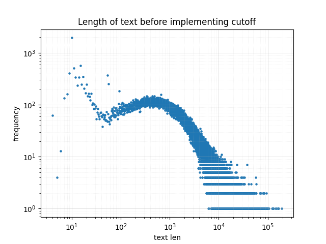
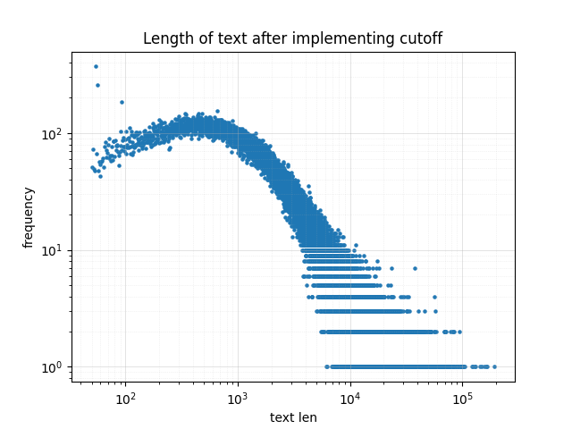

# LLM Data Pipeline

This repo implements the full pipeline for obtaining natural language data at scale and processing it into a form that can be used to train large language models.

I use the pipeline to process over 50k Wikipedia articles, yielding ~1GB of clean, LLM training-ready data.
In the [`data`](data) folder we show a small subset of our data as it flows through the pipeline.

The pipeline involves the following steps:
1. [Crawling and Scraping](#1-crawling-and-scraping)
2. [Parsing](#2-parsing)
3. [Normalization](#3-normalization)
4. [Deduplication](#4-deduplication)
5. [Sentence Segmentation](#5-sentence-segmentation)
6. [Tokenization](#6-tokenization)

## 1. Crawling and Scraping
The first step to obtaining LLM training data is to scrape text from the internet by crawling through webpages.
I implemented a crawler and scraper for Wikipedia.
The crawler starts with the seed urls located in [`config.yaml`](config/config.yaml). 
I used a single seed url, [List of Academic Fields](https://en.wikipedia.org/wiki/List_of_academic_fields), starting from which my program crawled and scraped 51,445 English language articles, totalling ~12 GB of unprocessed HTML data.

To avoid getting blocked by Wikipedia for making too many requests to their server in too short a time frame, I incorporated rate limiting logic into the scraper.
This ensured that I only send one get request to Wikipedia every second on average, in abidance with their bot policy.

### Files:
- Source code: [`src/crawl.py`](src/crawl.py)
- Script: [`scripts/run_crawl.py`](scripts/run_crawl.py)
- Log file: [`log/crawl.log`](log/crawl.log)
- Data sample: [`data/crawl_data_5.jsonl`](data/crawl_data_5.jsonl)

## 2. Parsing
After crawling and scraping the data is in HTML form. 
The next step in the pipeline is to parse the HTML into a more human-readable format. 
I used the [Beautiful Soup](https://beautiful-soup-4.readthedocs.io/en/latest/) library to aid with HTML parsing.

At a high level my parser works as follows:
1. Split each wikipedia article into sections
2. Recursively parse each section by parsing its HTML child nodes

The parser can be run concurrently on multiple processors.

Following parsing the 12 GB of HTML data was reduced to ~1GB of human-readable text.

### Files:
- Source code: [`src/parse.py`](src/parse.py)
- Script: [`scripts/run_parse.py`](scripts/run_parse.py)
- Log file: [`log/parse.log`](log/parse.log)
- Data sample: [`data/parse_data_5.jsonl`](data/parse_data_5.jsonl)

## 3. Normalization
After parsing the next step is to normalize the data. 
I chose to implement the following normalizations:
1. Unicode normalization
2. Whitespace normalization
3. Quote and dash normalization

### Length normalization

In addition I normalized the length of the text in my dataset.
Before this step the lengths of individual pieces of text in my dataset are distributed as follows:

The distribution of texts with more than 50 characters follows a nice Gaussian looking distribution (in log space, and with a tail).
However there is significant noise in the distribution of texts shorter than 50 characters. 
Inspection of a few of the article sections contributing to this noise indicates that they typically correspond to typos, stub articles / sections, or other undesired pieces of text.
Therefore I remove all text which contains fewer than 50 characters.
This reduces the number of article sections by ~0.02%, from 303,845 to 295,429.
Following this normalization the length distribution is:

### Files:
- Source code: [`src/normalize.py`](src/normalize.py)
- Script: [`scripts/run_normalize.py`](scripts/run_normalize.py)
- Log file: [`log/normalize.log`](log/normalize.log)
- Data sample: [`data/normalize_data_5.jsonl`](data/normalize_data_5.jsonl)

## 4. Deduplication
At this point each of the ~300k pieces of text in the dataset is in a clean natural language format.
A concern at this stage of the pipeline is that some of these pieces of text contain significant overlap with one another. 
In fact [it has been shown](https://arxiv.org/abs/2205.10487) that even a small amount of duplicate text within an LLM's pretraining data can significantly harm its performance.
To that end I implement deduplication to deduplicate texts that are identical or sufficiently similar.

### Naive algorithm

The basic motivation for my deduplication algorithm is to compare pieces of text pairwise and remove one item from the pair if the two texts have n-gram sets which are sufficiently similar (more precisely if their [Jaccard similarity](https://en.wikipedia.org/wiki/Jaccard_index) is above a certain threshold). 
However a brute force implementation of this algorithm requires $N \choose 2$ pairwise comparisons, where $N$ is the number of texts, leading to an $\mathcal{O}(N^2)$ runtime. 
This is prohibitive in our case, where $N\sim300\text{k}$.
To overcome this we make two improvements to the brute force algorithm:

### Improvement 1: MinHash

The first improvement is to standardize the signatures of the different pieces of text.
In the naive algorithm the signature of a text is its n-gram set $S$, and different texts have n-gram sets of different sizes.
The MinHash algorithm uses $k$ hash functions, and to each text it assigns the signature $(m_1, \dots, m_k)$ where $m_i$ is the minimum hash value of the $i^\text{th}$ hash function over the n-gram set $S$.
Thus the MinHash signatures are standardized to $k$-tuples with integer values.

While this standardization is a nice feature, the main significance of MinHash is the fact that the fraction of identical elements in two MinHash signatures is an unbiased estimator of the Jaccard similarity of the two pieces of text.
Thus given the MinHash signatures of two texts it is straightforward to estimate how similar the texts are.

### Improvement 2: Locality Sensitive Hashing

With the signature standardization provided by MinHash, it is possible to reduce the $\mathcal{O}(N^2)$ runtime of the naive deduplication algorithm by means of [Locality Sensitive Hashing (LSH)](https://en.wikipedia.org/wiki/Locality-sensitive_hashing).
The idea of this approach is to split the MinHash signatures into equally sized bands, feed the bands one by one into a single hash function, and only compare two pieces of text if their hash values are equal in at least one band.
This typically reduces the number of comparisons to a number much smaller than the original $N \choose 2$. 

### Results:

Following this approach, with gram length $n=5$, MinHash signature length $k=128$, LSH band size $b=16$, and Jaccard similarity threshold $r=0.8$, I find and remove 7,628 duplicate pieces of text. (Note that there are no duplicates in the small data sub-sample shown in this online repo.) 

### Files:
- Source code: [`src/deduplicate.py`](src/deduplicate.py)
- Script: [`scripts/run_deduplicate.py`](scripts/run_deduplicate.py)
- Log file: [`log/deduplicate.log`](log/deduplicate.log)
- Data sample: [`data/deduplicate_data_5.jsonl`](data/deduplicate_data_5.jsonl)

## 5. Sentence Segmentation

The individual pieces of text of my dataset consist of entire sections of Wikipedia articles.
For the purposes of training LLMs, especially ones with smaller context windows, it is often beneficial to have smaller text samples, such as individual sentences.
Implementing accurate sentence segmentation is surprisingly challenging, since it requires accounting for many edge cases.
For instance a naive implementation would split text at periods, exclamation marks and question marks, but clearly this simple approach would not be very accurate since, for example, it would incorrectly split text at abbreviations.
For the purposes of this project I take the easy way out and use a third-party library ([spacy](https://spacy.io/)) to perform sentence segmentation.
I leave the from-scratch implementation of a sentence segmentater for a future project.

The segmenter can be run concurrently on multiple processors.

### Files:
- Source code: [`src/segment.py`](src/segment.py)
- Script: [`scripts/run_segment.py`](scripts/run_segment.py)
- Log file: [`log/segment.log`](log/segment.log)
- Data sample: [`data/segment_data_5.jsonl`](data/segment_data_5.jsonl)

## 6. Tokenization

The final step in an LLM data prepartion pipeline is to tokenize each piece of text into a sequence of integer tokens which can be used as direct input into a neural network architecture.
A common approach to tokenization, which I implement here, is [Byte Pair Encoding (BPE)](https://en.wikipedia.org/wiki/Byte_pair_encoding).
The BPE algorithm consists of two parts:

### 1. Creating BPE vocabulary

The goal of this part of the algorithm is to use a large corpus of text to construct a *vocabulary*, i.e. a set of tokens, which represent the atomic constituents of the text.
This is done as follows:
1. Initialize the vocab to the unique characters of the corpus
2. Find the most frequent adjacent pair of tokens in the text
3. Combine this pair of tokens into a new token, and add it to the vocab
4. Repeat steps 2 and 3 until the vocab is the desired size

Each iteration of this algorithm requires passing through the entire corpus, so it is fairly slow for a large corpus.
A simple optimization to improve efficiency is to use a word frequency dictionary constructed from the corpus, instead of the corpus itself, when computing pair frequencies.
However even with this optimization the algorithm is very time consuming: for our ~1GB corpus it takes several seconds to add a single new token to the vocabulary.

### 2. BPE tokenization

After the vocabulary is built, it can be used to tokenize any piece of text.
This is straightfoward to implement: the text is looped over character by character and at each character $c$ the longest possible token (i.e. a token within the vocab) is constructed from $c$ and subsequent characters.
This results in each string of text being converted into an array of individual tokens. 
These tokens can be encoded into unique integers, and the array of integers, representing the text, is ready to be passed into a neural network.

### Files:
- Source code: [`src/bpe_freqdict.py`](src/bpe_freqdict.py), [`bpe_vocab.py`](src/bpe_vocab.py), [`src/bpe_tokenize.py`](src/bpe_tokenize.py)
- Script: [`scripts/run_bpe_freqdict.py`](scripts/run_bpe_freqdict.py), [`scripts/run_bpe_vocab.py`](scripts/run_bpe_vocab.py), [`scripts/run_bpe_tokenize.py`](scripts/run_bpe_tokenize.py)
- Log file: [`log/tokenize.log`](log/tokenize.log)
- Data sample: [`data/tokenize_data_5.jsonl`](data/tokenize_data_5.jsonl)
